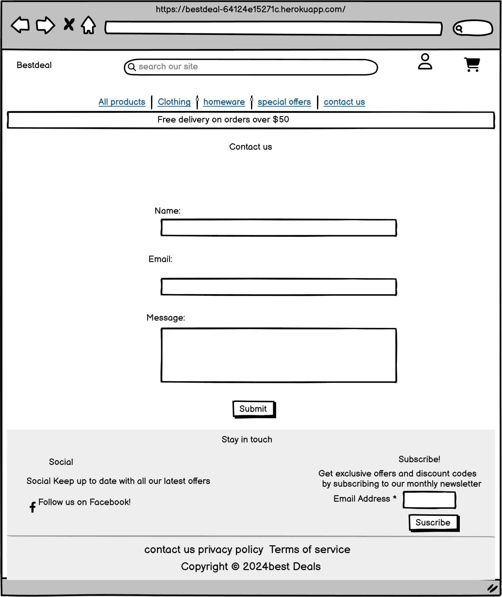
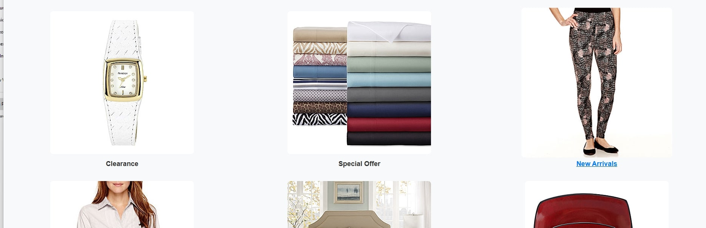
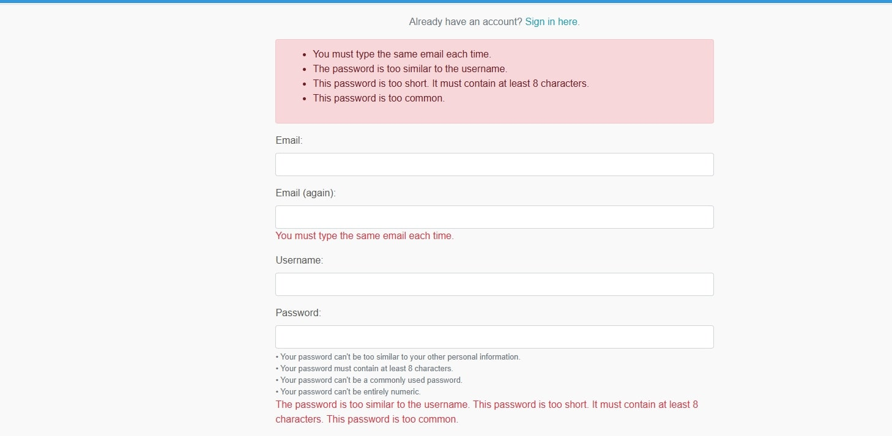
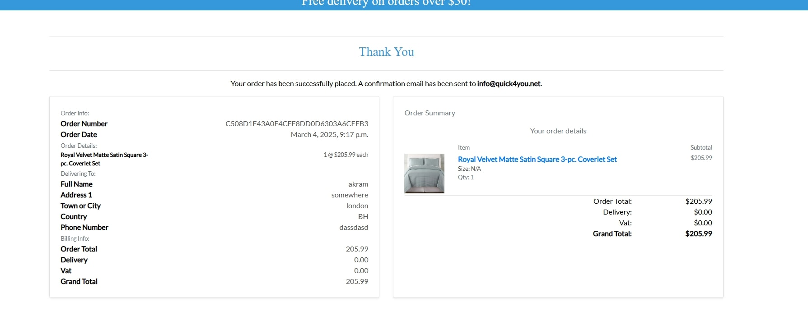

# bestdeal 

## Welcome! 
[View the live project here .](https://bestdeal-64124e15271c.herokuapp.com/)

[View GitHub repository .](https://github.com/akramalex/bestdeal)

## Introduction

Best Deal is an eCommerce platform designed to provide customers with easy access to a variety of products to buy. Our platform offers a wide range of products across categories like electronics, fashion, home goods, and more.

Visitors to the website can browse products, view detailed information, and make purchases with ease. The platform also provides a secure and seamless shopping experience, including features like product search, filtering options, and a simple checkout process.

Administrators have full CRUD capabilities to manage (add, edit, delete) products via a user-friendly admin interface. The admin panel also allows for inventory management and order tracking.

To ensure a smooth customer experience, all orders undergo verification before being processed for delivery.

## UX
  ### The Strategy
  
  #### Site  Aims

- Provide a Seamless Shopping Experience
To allow customers to easily browse, select, and purchase products in a convenient and straightforward manner, ensuring an enjoyable shopping journey.

- Facilitate Product Discovery
To provide detailed product descriptions, clear images, and customer reviews, enabling users to make informed purchase decisions.

- Ensure Secure Transactions
To ensure customers feel confident while making purchases by offering a secure, streamlined checkout process with multiple payment options.

- Drive Customer Engagement
To encourage repeat purchases by offering features like product reviews, ratings, wishlists, and personalized recommendations based on browsing history and preferences.

- Provide Exceptional Customer Support
To offer real-time customer support through multiple channels like chat, email, or phone, addressing issues promptly and providing assistance throughout the customer’s journey.

- Offer a User-Friendly Platform
To create an intuitive, easy-to-use shopping platform that is fully responsive and works seamlessly across different devices (mobile, tablet, desktop).

- Improve Visibility and Ranking on Search Engines
To improve visibility and ranking on search engines like Google. Implement SEO best practices, ensuring the website is easily discoverable by users searching for related content.

#### Scope 

Given the time and resource constraints, we will prioritize core features for the MVP (Minimum Viable Product). These features are categorized as Must-Have, Should-Have, and Won’t-Have for the initial release, and can be expanded in future phases.

#### UX Efforts Must Address These:

 1- User Login & Authentication

 * Users must be able to easily create an account and log in to the platform. The login and registration process should be smooth and secure, with options for password recovery.

 2- Product Browsing & Searching

 * Implement a seamless product browsing experience. Ensure that the search bar is prominent, and users can filter and sort products by categories, price,  rating, . This will help users find products quickly and efficiently.

3- Product Page Design

 * Each product page should clearly display product details, such as name, description, price, reviews. High-quality images, videos, and size/color options should also be available in a user-friendly layout.

4- Seamless Shopping Cart Experience

 * Users should easily add items to their shopping cart and view the total cost, with options to update quantities, remove items.

 5- Simplified Checkout Process

 * The checkout process should be simple and secure, offering  payment option (Stripe). Allow users to review their order before confirming the purchase.

 -6 Responsive Design for All Devices
 * Ensure that the website is fully responsive and works seamlessly across mobile phones, tablets, and desktops. This is crucial for maintaining a consistent experience for all users, regardless of their device.   

 7- Order Confirmation
 * After a purchase is made, users should receive an email confirmation.

 8 - User Reviews & Ratings 

 * Implement a product review system that allows customers to rate products and share feedback. This feature will help potential buyers make informed decisions and increase user engagement.

 9 - Wishlist Feature

 * Provide users with the ability to add products to a wishlist. This helps users save products for future purchases and enhances their shopping experience by reminding them of items they’re interested in.

 10 - Customer Support Access

 * Make customer support easily accessible through chat, email, or phone. Provide FAQs or a help center to assist with common queries. Fast response times are essential to maintaining customer satisfaction.

 11 - Simple and Intuitive Navigation

 * The navigation menu should be easy to understand and navigate. Categories and subcategories should be clearly defined, and users should be able to access all relevant pages, such as product listings, shopping cart, and user profile, with minimal effort.

 12-  Security and Privacy
 
 * Customers should feel confident when making transactions on the site. Use secure payment gateways and ensure that customer data is protected with SSL encryption. Also, display privacy policies clearly.

 13 - Product Recommendations

 * Use data-driven algorithms to recommend products based on users' browsing history, past purchases, or popular items. These personalized suggestions can help increase sales and improve the overall user experience.

14 - SEO Optimization 

* Optimize the website for search engines to ensure that products are easily discoverable by users. Use proper metadata, image alt text, and structured data to improve the site's ranking in search results.

#### UX Efforts Should Accommodate These:

1- Product Excerpts on Homepage 
* Display product previews, such as product names, prices, and images, on the homepage to give users an easy glimpse of what's available. Clicking on a preview should lead to the product detail page.

2- Contact Form 
* Include a simple, easy-to-use contact form that allows users to reach out to administrators with inquiries, suggestions, or support requests. Ensure the form is visible and accessible, and provide a thank-you message after submission.

3- Guest Checkout Option

* Offer a guest checkout option for users who prefer not to create an account. However, encourage users to sign up for an account by offering benefits such as order tracking, wishlists, and faster future checkouts.

4- Order History for Customers

* Enable customers to easily view and track their order history, including past purchases and the status of current orders. Users should also be able to reorder items they previously bought.

5- Advanced Filtering Options 

* Allow users to filter products by a variety of parameters (e.g., price range, color, size, rating, and more). This will make it easier for users to find exactly what they are looking for.

#### Unwise Use of Time to Address There:

1 - Promotions and Discounts Section
* Create a dedicated section for promotions, deals, or discounts, easily accessible from the homepage. This section should be highlighted to encourage users to take advantage of special offers.  will be in time wise 

2- FAQ Section 

* Add a frequently asked questions (FAQ) section to help users find answers to common queries about products, returns, shipping, payment methods, etc.

3- Stock Availability Alerts

* Notify users if a product they are interested in is out of stock and offer the option to be alerted when it becomes available again. This feature can help increase sales when products are restocked.

4 -Product Comparison Tool 

* Allow users to compare similar products side-by-side, making it easier to choose between different options based on features, price, and ratings. 

5- Basic Admin Analytics
* Track basic metrics for the admin, such as the number of items added to the cart, purchases made, and product popularity. This data will help the admin understand the market and optimize the product offerings.

### Structure
To help visualize a typical user journey around the site, I used [lucid.app](https://lucid.app/) to plan out the various routes. Unfortunately, due to the limitations of the free version of the tool, I am unable to provide a more detailed picture of the user journey. However, the flow provides a clear representation of how users would typically navigate through the platform.

#### User Stories:

  - as developer..

     *  i can create a new AWS S3 bucket so that I can store static files and images securely.

     * i can create a Heroku app so that I can link to a virtually hosted PostgreSQL database for the deployed site.

     *  i can set up my local coding environment so that I can develop securely and deploy without revealing sensitive information.

     *  i can install Django and required libraries so that I can work with a PostgreSQL database and cloud-based images from my local development IDE.

    
    * i can create a GitHub repository so that I can store my project files online.

 - as a admin / owner..

    * i want to increase my search engine ranking so that  I can increase the number of visitors to my site

    * i want to set up a social media page so that I can promote my business and products to the global market.

    * i can send promotional emails so that I can promote new products and offers to my customers.

    *  i can manually manage stock levels so that I can input received purchase orders and ensure that the stock levels are accurate in case of discrepancies or damages.

    * i can delete a product so that I can remove products that are no longer for sale.

    *  i can edit or update a product so that change product details.

    *  i can add a product so that I can add new products to the store.

- as a site user / shopper..

   *   i can add and remove products from my wishlist so that I can easily keep track of the products I am interested in and purchase them later.

   *  i can securely submit my payment details so that I can rest assured my financial information is safe.

   *  i can access the checkout page so that I can review my order while entering my payment/shipping details.

   * i can receive an email confirmation after checking out so that I can keep a record of my order.

   *  i can view an order confirmation after checkout so that I can verify that I haven’t made any mistakes.

   * i can adjust the quantity of individual items in my bag so that I can easily make changes to my bag.

   * i can select a quantity of a product so that I can buy the required amount of the product.

   * i can search for a product by name or content in the product description so that I can find a specific product I am looking for.

   *  i can sort the list of available products so that I can view them in different orders and find the highest/lowest ratings or prices and sort alphabetically to aid in finding the most suitable products for my needs.

   *  i can receive an email confirmation upon registration so that I can confirm the registration process worked correctly. 

   * i can recover my password in case I forget it so that I can regain access to my account in the event I lose my password.

   *  i can amend my personal details from my profile so that I can update information should there be any changes.

   *  i can save my personal details to my profile from the checkout page so that I don’t have to enter them every time I make a purchase.

   * i can easily log in or log out at any time so that I can access my personal account information and protect it from unauthorized viewing on shared devices.

   *  i can register for an account so that I can save my personal details and view my order history online.

   *  i can easily contact the store owner so that I can ask questions about products or the site.

   *  i want to see a pleasantly styled and easy-to-navigate site so that I can enjoy the experience of shopping.

   *  i can see clearly when something goes wrong on the site so that I can correct any errors and continue my purchase.

   *  i can view reviews of a product so that I can see what others think.

   *  i can leave a review so that share my opinion of a product and leave a star rating.

   * i can view the total of my purchases at any time so that I can review how much I am spending whilst building an order.

   *  i can view individual product details so that  identify the price, description, reviews, and product images to compare with other items.

   * i want to view a list of products so that I can select some to purchase.

   *  i want to clearly identify the site's purpose upon visiting so that I can determine if the site is what I am looking for.

   * i can access a live URL so that I can use the site on any device.

   ###### Acceptance Criteria
   

###  Skeleton

  #### Wireframes:
  The appearance of each page of the website was planned by making wireframes. It was essential to provide a positive user experience for the user.

Initially, wireframes plans were hand-drawn on a notepad. More detailed wireframes were then created using a desktop version of [Balsamiq](https://balsamiq.cloud/). 
They can be found below:

 - home page

- Products page

- Product details page

- contact us  page

- small screen

###  Database Design

Entity Relationship Diagrams (ERDs) help to visualize database architecture before creating models. Understanding the relationships between different tables can save time later in the project. To follow best practices, a database schema was created for the backend DB and tables, and mapped out before coding began using a free version of [Lucidchart](https://lucid.app/).

Below is the database structure:

#### Surface

#### Color Scheme: 

I used the following image to generate the color scheme on [coolers](https://coolors.co/). The resultant color scheme is:

##### Typography:

 * Leckerli:

     Used for: The brand name in the navbar and the text in the hero section, creating a clean, modern look
.

* lato:

     Used for: Body text and general content, providing readability and clarity.

## Features

The following features have been implemented:

* Fully responsive website consisting of:
* Home
* All products
   - by Price
   - by Rating
   - By Category
   - All Products
* Clothing
   - Activewear & Essentials
   - jeans
   - shirts
   - All Clothing
* Homeware
    - bed & bath
    - Kitchen & Dining
    - All Homeware

* Special Offers 

   - New Arrivals
   - Deals
   - Clearance
   - All Specials

* Contact us 

* My  Account 
    -  Register
    -  Login
        * profile
    
* bag    
* product Details - With CRUD functionality for logged-in users to add/remove from the wishlist, leave reviews and ratings. and for super administrators to edit/remove products.

*  Admin - with CRUD functionality for logged in superadministrators

### Site Navigation

### Navbar

* Featured at the top of the page, the navigation displays a burger menu. Next to it are the options for Search, My Account, and Bag.

* The other navigation links that appear once the burger menu is opened are: Home, All Products, Clothing, Homeware, Special Offers, and Contact, each linking to different pages of the site.

* When the user hovers over a link, the link appears in bold.

* The navigation clearly displays the name of the company and website.

* The navigation makes the different sections of information easy to find.

* On smaller devices, the navigation converts to a burger menu.

### Homepage

* The homepage consists of a large hero image that changes to different images. In total, there are four images, where the user is welcomed to the site and provided with a "Shop Now" button.

* "The new collections are here," and the "Shop Now" button takes the user to the "All Products" page.

* Below the hero section, there are 6 sections, each with an image and a category. Clicking on any section takes the customer to the specific category they're interested in.

* Each category is displayed in a Bootstrap card, containing the category's name, and a featured image.

* On smaller devices, the layout changes to one column per category to maximize usable screen space.

### All products

 * Each product can be clicked, bringing the user to the product details page for that specific product.

- EEach product card contains the image, price, category, rating, and two buttons: "Add to Bag" and "Details." If the item has size options, the buttons will display "Choose Size" and "Details."

- If the customer presses "Add to Bag," the item will be added to the shopping bag directly, with a notification confirming the action.

-  If the customer presses "Details," they will be taken to the product details page for that specific item.

- If the item has size options, both buttons, "Choose Size" and "Details," will take the customer to the product details page, where they can select the size before adding the item to the cart. 

- To save the customer's time, there is an arrow in the bottom right corner of the page that allows the customer to quickly return to the top of the page at any time.

### product details

- The product details page consists of 4 sections.

   * The first section displays the product image on the left-hand side.

   * The second section on the left-hand side includes:

       - Item title
       - Price
       - category
       - rating
       - Add to Wishlist (only for registered customer )
       - edit| delete (only for superusers)
       - Description
       - Discount tiers (if available)
       - Size options (if the item has sizes)
       - Quantity input 
       - Two buttons: "Add to Bag" and "Keep Shopping".

   * The third section: Reviews and Rating Section:

       - Registered users can rate the product, leave a review, and edit or delete their review if needed.

       - Non-registered users can view reviews and ratings but will see a prompt encouraging them to log in to leave a review.

    * The last section is "Rated Items You May Like" 
      
       - It appears at the end, showing several items to the customer. The items keep moving, and if the customer is interested in any of them, pressing "Add to Bag" or "Details" will take them to the product details page, ensuring the customer can read all the descriptions about the item.

### Contact Page

* The Contact page consists of a form that users can use to get in touch with best.

* Front-end validation code ensures users must fill out all fields in order to submit the contact form.

* Once the user submits a message, they are shown a confirmation message stating: "Thank you! Your message has been submitted successfully. We will get back to you shortly." Below the message, a button is provided to redirect users back to the homepage.

* I also ensured that any required elements removed from the front-end trigger an error notifaction  "There was an error. Please try again."

### login, logout, register 

* Users can register for an account by filling out the registration form.

* This form is validated on the front end to ensure users submit the required information.

* Password rules apply:
  - Your password can’t be too similar to your other personal information.
  - Your password must contain at least 8 characters.
  - Your password can’t be a commonly used password.
  - Your password can’t be entirely numeric.
  - The password must be entered twice, and the two passwords must match.

* Clicking the sign-up button will create a new user, and the user can then sign in and use the user functionality on the website.

* Users can log in from the login page by entering the correct username and password.

* Users can easily log out by clicking the logout button in the navigation bar.

### My Profile

- My Profile Page is a simple profile page with the following sections:

   * Profile Update Form: 

      - Allows users to update their information, including full name, phone number, street address 1, street address 2, town or city, county, postal code, and country.

   * Order History :
      - Shows the customer’s order history, displaying the order number, date of order, item titles, and order total.

   * Wishlist:
     
     - Displays the products the customer has added to their wishlist. It includes the item image and two buttons: "Remove from Wishlist" or "Details," which take the customer to the product details page.

  

### Product Management

- Product Management Page allows superuser to add or edit products:

  * Add Product:

     -  Once you open the product management page, a form will appear to add a product by filling in the category, SKU, name, description, size (if applicable), price, rating, image URL, and VAT applicability.

     - If the item is added correctly, you will receive a notification stating the item was added. If something is wrong, an error notification will appear.

  * Edit Product:

     - To edit a product, press on any product page and click "Edit." This will open the product management page.

     - If the update is successful, you will receive a notification stating the update was successful. If not, a failed notification will appear.

### bag 

-  If the bag is empty, the page will inform the customer that their bag is empty, with a button labeled "Keep Shopping" that takes them to the product page.

 - If the bag contains items, it will display the product information: name, size (if applicable), and SKU. On the other side, the item price and quantity will be shown, with the ability to increase or decrease the quantity or remove the item from the page. At the bottom, the bag total will be displayed, including the delivery cost (which is $0 if the order is over $50), VAT (if applicable), and the grand total. Two buttons will be provided: "Keep Shopping" (which takes the customer to the all products page) or "Secure Checkout" (which takes the customer to the checkout page).

### Checkout

 * The first section is the order summary, showing the item image, title, size, quantity, and a link to the product details page. Below it, the subtotal is displayed, followed by the order total, delivery cost, VAT, and the grand total.

* The second section is the "Complete Your Order" form, which includes the customer’s details and delivery address. If the customer’s information is already saved, it will be displayed automatically. If not, there will be a button to save the delivery info. At the end, the payment card details will be required, with two buttons: one to complete the order and another to adjust the bag.

* In the payment process, if the card is invalid or any required fields are not completed, an error message will be shown, indicating the issue (e.g., "Invalid card" or "Please complete all required fields").

* When the payment process is ongoing, an overlay will appear on the screen to indicate that the payment is being processed.

##### Checkout success

 - Once the payment is done, the user will be redirected to the checkout success page with a message on top: "Your order has been successfully placed. A confirmation email has been sent to (customer email address)."

 - The checkout success page has two sections:
     * Order Summary: Displays the item title (with a link to the product details page), size, quantity, subtotal, order total, delivery cost, VAT, and the grand total.
     * Order Info: Shows the order number, date, item name, delivery address, and billing information.

 

 - At the end, there's a message thanking the customer for shopping with us, along with two buttons:

   * Back to Profile (for registered users).

   * Check out the latest deals.

 

