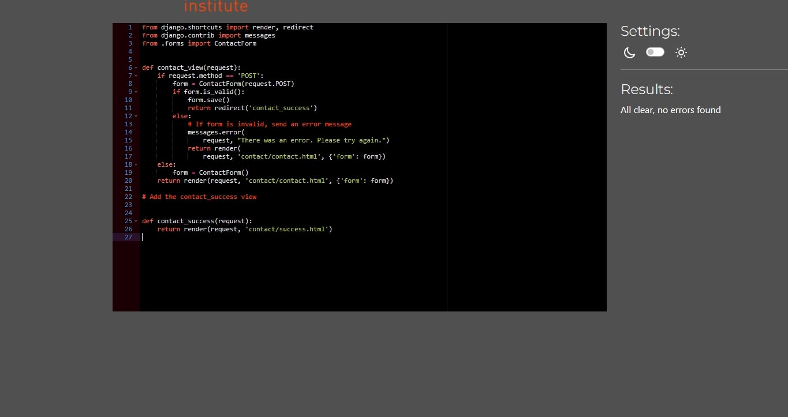
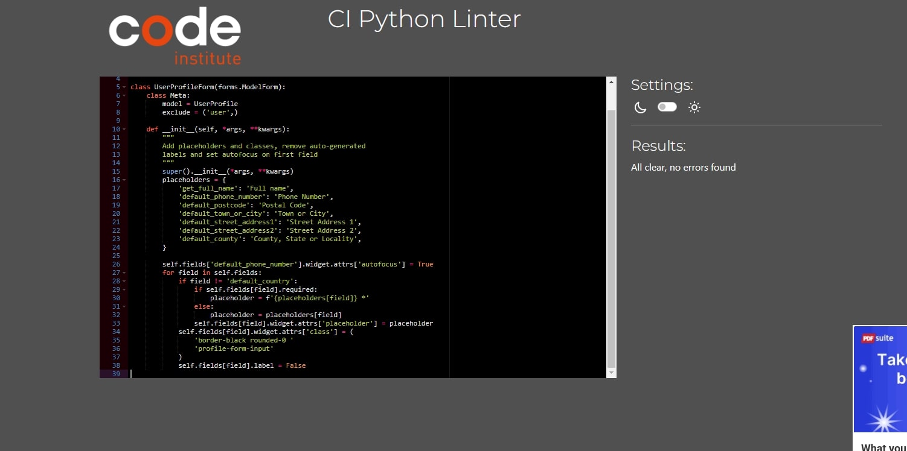

# Testing

Return back to the [README.md](https://github.com/akramalex/bestdeal/blob/main/README.md) file.

* I tested that this page works in different browsers: Chrome, Firefox, Safari, Internet Explorer.

* I confirmed that this project is responsive, looks good, and functions on all standard screen sizes using devtools and the device toolbar.

* I confirmed that the navigation header, "all product," "my account", "profile", "bag", "product management", "register /sign in / log out" and "Contact" text are all readable and easy to understand.

* I have confirmed that the form works, requires entries in every field, and will only accept an email in the email field.

### HTML 

I have used the recommended HTML [W3C Validator](https://validator.w3.org/) to validate all of my HTML files.

* Home 
   

* product

    
    

* product details

   

   

* bag 

  
  

* checkout 

  

* contact

   

* login

  

* logout

  

* sign up

  

* profile

  

### CSS  

I have used the recommended [CSS Jigsaw Validator](https://jigsaw.w3.org/css-validator/) to validate all of my CSS files.

### JavaScript 

I have used the recommended [JShint Validator](https://jshint.com/) to validate all of my JS files.

* stripe_elements 

* promo-section

* review_script

* search-section

  

* updatePrice

### Python  

I have used the recommended [PEP8 CI Python Linter](https://pep8ci.herokuapp.com/#) to validate all of my Python files.

####  manage.py 

#### settings.py 

#### url.py 

#### wsgi

#### bag 

 * contexts

* url

* view

#### checkout

* admin

  

* forms

  

* models

  

* signals
  

* url 

  

* webhooks

  

* webhook_handler

  

#### contact

* admin

  

* forms

  

* models
   
   

* url 

  

* view 
  

#### product 

* admin

   

* view 

  

* forms 

   

* models

   

* url  

   

* widgets

   

   
 #### profile

 * forms 

   

* models

   

* url

  

* view 

  

