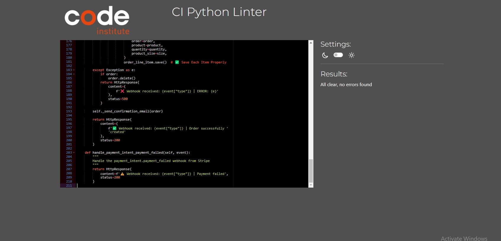
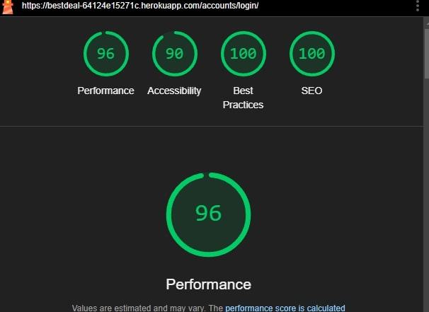

# Testing

Return back to the [README.md](https://github.com/akramalex/bestdeal/blob/main/README.md) file.

* I tested that this page works in different browsers: Chrome, Firefox, Safari, Internet Explorer.

* I confirmed that this project is responsive, looks good, and functions on all standard screen sizes using devtools and the device toolbar.

* I confirmed that the navigation header, "all product," "my account", "profile", "bag", "product management", "register /sign in / log out" and "Contact" text are all readable and easy to understand.

* I have confirmed that the form works, requires entries in every field, and will only accept an email in the email field.

### HTML 

I have used the recommended HTML [W3C Validator](https://validator.w3.org/) to validate all of my HTML files.

* Home 
   

* product

    
    

* product details

   

   

* bag 

  
  

* checkout 

  

* contact

   

* login

  

* logout

  

* sign up

  

* profile

  

### CSS  

I have used the recommended [CSS Jigsaw Validator](https://jigsaw.w3.org/css-validator/) to validate all of my CSS files.

### JavaScript 

I have used the recommended [JShint Validator](https://jshint.com/) to validate all of my JS files.

* stripe_elements 

* promo-section

* review_script

* search-section

  

* updatePrice

### Python  

I have used the recommended [PEP8 CI Python Linter](https://pep8ci.herokuapp.com/#) to validate all of my Python files.

####  manage.py 

#### settings.py 

#### url.py 

#### wsgi

#### bag 

 * contexts

* url

* view

#### checkout

* admin

  

* forms

  

* models

  

* signals
  

* url 

  

* webhooks

  

* webhook_handler

  

#### contact

* admin

  

* forms

  

* models
   
   

* url 

  

* view 
  

#### product 

* admin

   

* view 

  

* forms 

   

* models

   

* url  

   

* widgets

   

   
 #### profile

 * forms 

   

* models

   

* url

  

* view 

  

 ### Srtipe test 

 
 

 ### lighthouse 

####  Home 

  

  * mobile

  

#### bag

  * mobile

  

#### logout

 

  * mobile

  

#### contact

 

  * mobile

  

#### product details 

  * mobile

  

#### product 

  * mobile

  

#### log in 

  * mobile

  

#### sign up 

  * mobile

  

#### profile

  * mobile

  

## Manual Test 

all user stories is with acceptance criteria has been run into manual test 

1. add to wishlist
     - Acceptance criteria:
        * When I am on a product details page, I should see an option to "Add to Wishlist" if the product is not already in my wishlist.
       * When I click the "Add to Wishlist" button, the product should be added to my wishlist.

       * A success notification should appear confirming that the product has been added to the wishlist.

       * When I click "Remove from Wishlist", the product should be removed from my wishlist.

2. Increase Search Engine Ranking:
     - Acceptance criteria:
       * The website is optimized for SEO, including:
            - Meta titles and descriptions for all pages.
            -  Keywords embedded in product descriptions and content.
            - Fast loading speeds and mobile-friendly design.
       * Analytics tools (e.g., Google Analytics, Google Search Console) are integrated to track traffic and performance.

3. Set Up a Social Media Page:
     - Acceptance criteria:
       * The platform provides guidance or links to create pages on major social platforms (e.g., Facebook, Instagram, Twitter).
       * A "Follow Us" section is added to the website with links to the business's social media pages.

        
     
4. Send Promotional Emails:
     - Acceptance criteria:
       * An email marketing tool (e.g., Mailchimp, SendGrid) is integrated with the platform.

5. Manually Manage Stock Levels:
     - Acceptance criteria:
       * The admin dashboard displays stock quantities for all products.
       * An editable "Stock Level" field allows manual adjustments.
       * Changes are saved to the database and reflected immediately.

6. Manually Manage Stock Levels:
     - Acceptance criteria:
       * Each product in the admin dashboard has a "Delete" button.
       * Clicking "Delete" triggers a confirmation prompt to prevent accidental deletion.
       * Confirming the deletion removes the product from the database and the live site.
       
7. Edit/Update a Product:
     - Acceptance criteria:
       * Each product in the admin dashboard has an "Edit" button.
       * Clicking "Edit" opens a pre-filled form with the product’s current details.
       * Updates to fields (e.g., price, description, stock) are saved upon submission.
       * Changes are immediately reflected on the live site.
       
8. Add a Product:
     - Acceptance criteria:
       * The admin dashboard includes an "Add Product" button.
       * A form is available to input product details.
       * Clicking "Save" adds the product to the database and displays it on the live site.
       * Validation ensures all required fields are completed and in the correct format.
       
9. Secure Payment Submission:
     - Acceptance criteria:
       * Integrate with a secure payment gateway (e.g., Stripe, PayPal).
       * Users receive a confirmation that the payment was successful or an error message if the transaction failed.

10. Access Checkout Page:
     - Acceptance criteria:
       * A "Checkout" button is prominently displayed in the cart and product pages.
       * Validation ensures all required fields are completed before proceeding.
       

11. Receive Email Confirmation:
     - Acceptance criteria:
       * After completing a purchase, an email is sent to the user’s registered email address.
       * The email sender is labeled clearly as the store/website.

12. View Order Confirmation:
     - Acceptance criteria:
       * After completing a purchase, users are redirected to an order confirmation page.
       * The page displays  Order summary (items, quantities, total price) ,Shipping and billing details.
       * A "Back to Shop" button is available for users to continue browsing.

13. Adjust Quantity of Items in Bag:
     - Acceptance criteria:
       * The cart page allows users to increase or decrease quantities for each item.
       * Changes are saved dynamically and reflected in the total cost.
       * A "Remove" button is available to delete items from the cart entirely.

14. Select Product Quantity:
     - Acceptance criteria:
       * Product detail pages include a quantity selector (e.g., dropdown or input field).
       * The selected quantity updates dynamically in the shopping bag/cart.
       * Validation ensures only available quantities can be added to the cart.

15. Search for a Product:
     - Acceptance criteria:
       * A search bar is prominently displayed on the site.
       * Users can enter a keyword or phrase to search for products.
       * Search results include products matching the keyword in the name or description.

16. Sort Products:
     - Acceptance criteria:
       * The sorted order updates dynamically when a sorting option is selected.
       * Sorting persists across pagination or infinite scroll.
       * Sorting options are available on the product listing page

17. Email Confirmation Upon Registration:
     - Acceptance criteria:
       * Upon successful registration, an email is sent to the user’s provided email address.
       * The email includes a confirmation message and a link to verify the account .
       * The email sender is clearly labeled as the website or store name.

18. Recover Forgotten Password:
     - Acceptance criteria:
       * A "Forgot Password" link is available on the login page.

19. Amend Personal Details:
     - Acceptance criteria:
       * A profile page displays current personal details such as name, email, shipping address.
       * Editable fields allow users to update information.
       * Changes are saved to the database and reflected immediately.

20. Save Personal Details from Checkout:
     - Acceptance criteria:
       * During checkout, users can opt to save their shipping and billing details to their profile.
       * Saved details are stored securely in the database and appear pre-filled in future checkouts.
       * Users who are not logged in are prompted to log in or register to save their details.

21. Login or Logout:
     - Acceptance criteria:
       * A login page is available with fields for email and password.
       * Validation ensures correct credentials are entered.
       * A logout option is accessible from all pages and logs users out immediately, clearing session data.

22. Register for an Account:
     - Acceptance criteria:
       * A registration page is available with fields for name, email, password, and confirm password.
       * Validation ensures all required fields are filled and passwords match.
       * Successful registration saves user details to the database and logs the user in automatically.

23. Contact the Store Owner:
     - Acceptance criteria:
       * A "Contact Us" page provides a contact form and email address.

24. Pleasant Design and Navigation:
     - Acceptance criteria:
       * The site has a consistent and modern design with easy navigation menus.
       * The site is fully responsive and accessible on desktop and mobile devices.
25. Error Handling:
     - Acceptance criteria:
       * User-friendly error messages are displayed when an issue arises.
       

26. View Product Reviews:
     - Acceptance criteria:
       * Reviews are displayed on product pages with star ratings.
       * Reviews are sorted by recency or usefulness.

27. Leave a Review:
     - Acceptance criteria:
       * A review form allows authenticated users to submit written reviews.
       * Reviews can be edited or deleted by the reviewer.

28. View Total Purchases:
     - Acceptance criteria:
       * A shopping cart icon displays the current order total.
       * AThe cart updates dynamically when items are added or removed.
       * A detailed breakdown of items is shown in the cart view.

29. View Individual Product Details:
     - Acceptance criteria:
       * Product detail pages include the product name, price, description, high-quality images, and available stock.
       * Reviews and ratings are displayed with an option to view more details.

30. View a List of Products:
     - Acceptance criteria:
       * A product listing page displays items with images, names, prices.
       * Filters are available to narrow products by price, category, or ratings.

31. Site Purpose:
     - Acceptance criteria:
       * The navigation menu includes intuitive labels for product categories and features.
       * The homepage prominently displays the website's purpose with a clear tagline or hero section.

32. Access a Live URL:
     - Acceptance criteria:
       * The site is hosted on a live URL accessible via web browsers on desktop, mobile, and tablet devices.
       * The site is optimized for cross-browser compatibility (e.g., Chrome, Safari, Firefox).
       
33. Create an AWS S3 Bucket:
     - Acceptance criteria:
       * An S3 bucket is created with proper permissions (public/private as needed).
       * Static and media files are configured to upload to S3 using Django or a library like django-storages.
       * The bucket is integrated with the application using secure credentials.

34. Create a Heroku App:
     - Acceptance criteria:
       * A Heroku app is created and configured for deployment.
       * The Heroku Postgres add-on is integrated with the app.
       * Environment variables for database credentials are set in Heroku.

35. Local Coding Environment:
     - Acceptance criteria:
       * Sensitive credentials are stored in an .env file and accessed using environment variables.
       * Development and production settings are clearly separated.
       * Debugging tools are configured for local development.

36. Install Django and Required Libraries:
     - Acceptance criteria:
       * Django is successfully installed and configured.
       * Libraries for PostgreSQL (psycopg2 or similar) are installed.

37. GitHub Repository:
     - Acceptance criteria:
       * The repository should support version control for all project files.
       * A .gitignore file is included to exclude unnecessary files (e.g., virtual environment, .env).

 # bug

##  Unresolved bugs

 There are no other unresolved bugs that I am aware of.

 ### Fixed Bugs

 * After deploying on Heroku, the CSS was not working properly. This issue was resolved by connecting to AWS.

 * Increasing and decreasing the quantity in the bag did not work on big screens. This issue was fixed by changing the ID to a class and updating the JavaScript for it.
 
 Return back to the [README.md](https://github.com/akramalex/bestdeal/blob/main/README.md) file.